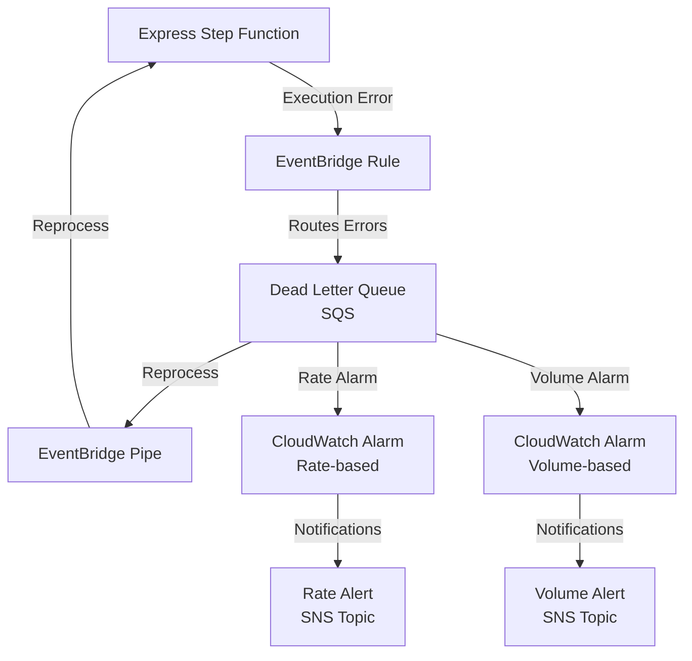

# Terraform AWS Step Function Error Notification

This module sets up an error handling and notification system for AWS Step Functions using EventBridge Rules, SQS DLQ, CloudWatch Alarms, and SNS Topics. It provides an EventBridge Pipe to allow operators to turn on/off dead letter queue reprocessing.

## Architecture Diagram



## Monitoring Express Step Functions with EventBridge

Express Step Functions need special handling to support global error notification based on EventBridge events. Unlike Standard Step Functions, Express Step Functions do not automatically generate EventBridge events for execution errors. This module provides a way to capture and route these errors to a DLQ.

In order for any Express Step Function to automatically generate execution failure events to EventBridge, we introduce a CloudWatch Log Group Subscription Filter on the Express Step Function's Log Group. This filter forwards all log events matching the pattern `{ $.type = "ExecutionFailed" }` to a Lambda which publishes those log events to EventBridge.

This module does the following for each provided Express Step Function:

1. Creates a CloudWatch Log Group Subscription Filter on the Express Step Function's Log Group to send log events to a Lambda which publishes execution failure events on EventBridge on the default event bus
2. Creates an EventBridge Rule to capture Express Step Function execution failure events on the default event bus
3. Creates an EventBridge Target to route execution failure events to the Dead Letter Queue in SQS
4. Creates a CloudWatch Alarm to monitor the rate of execution failures
5. Creates a CloudWatch Alarm to monitor the total number of execution failures
6. Creates an SNS Topic to notify operators of execution failure rate alerts
7. Creates an SNS Topic to notify operators of execution failure volume alerts
8. Creates an EventBridge Pipe to allow operators to turn on/off dead letter queue reprocessing to the Express Step Function

This module creates a single instance of the Lambda function which is shared across all Express Step Functions.

## Components

- **Lambda Function**: Publishes execution failure events to EventBridge on the default event bus
- **CloudWatch Log Group Subscription Filter**: Subscribes to the Express Step Function's Log Group and forwards log events to the Lambda function
- **ExpressStep Function**: The state machine being monitored for errors
- **EventBridge Rule**: Captures and routes Express Step Function execution errors to Dead Letter Queue
- **SQS Dead Letter Queue**:
  - Stores failed execution details
  - Used to retry failed Step Function executions
  - Monitored by CloudWatch Alarms
- **CloudWatch Alarms**:
  - Rate-based: Monitors error frequency
  - Volume-based: Monitors total error count
- **SNS Topics**:
  - Rate alerts: Notifications for error rate thresholds
  - Volume alerts: Notifications for error count thresholds
- **EventBridge Pipe**: Allows operators to turn on/off dead letter queue reprocessing

## Usage

```hcl
module "example_context" {
  source     = "registry.terraform.io/SevenPico/context/null"
  version    = "2.0.0"
  context    = module.context.self
  attributes = ["example", "sfn"]
}

module "express_step_function_error_notification" {
  source                = "../../"
  context               = module.example_context.self
  state_machine_arn     = aws_sfn_state_machine.example.arn
  eventbridge_pipe_name = "error-handler-pipe"
  sqs_queue_name        = "error-dlq"
}
```

## License

This project is licensed under the MIT License.
