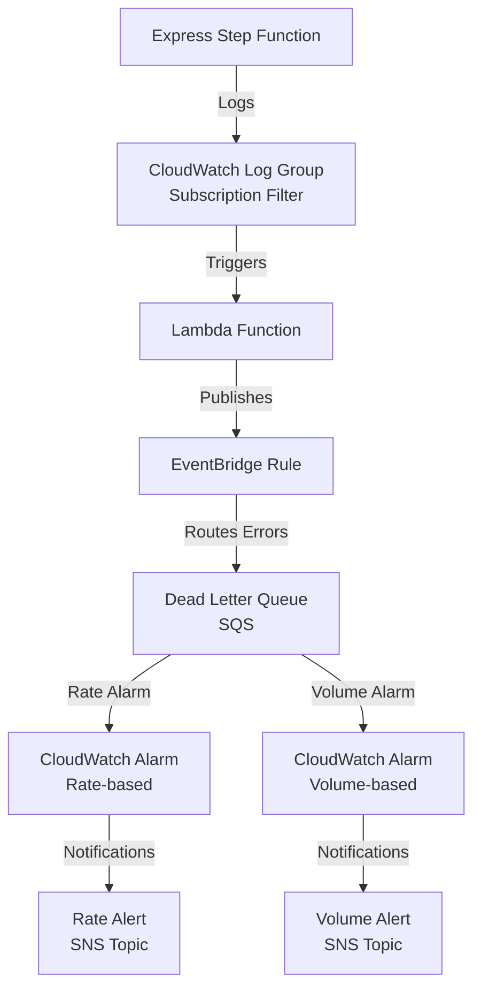

# Terraform AWS Step Function Error Notification

This module sets up an error handling and notification system for AWS **Express** Step Functions using EventBridge Rules, SQS DLQ, CloudWatch Alarms, and SNS Topics.

<!-- It provides an EventBridge Pipe to allow operators to turn on/off dead letter queue reprocessing. -->

## Architecture Diagram



## Monitoring Express Step Functions with EventBridge

Express Step Functions need special handling to support global error notification based on EventBridge events. Unlike Standard Step Functions, Express Step Functions do not automatically generate EventBridge events for execution errors. This module provides a way to capture and route these errors to a DLQ.

In order for any Express Step Function to automatically generate execution failure events to EventBridge, we introduce a CloudWatch Log Group Subscription Filter on the Express Step Function's Log Group. This filter forwards all log events matching the pattern `{ $.type = "ExecutionFailed" }` to a Lambda which publishes those log events to EventBridge.

This module does the following for each provided Express Step Function:

1. Creates a CloudWatch Log Group Subscription Filter on the Express Step Function's Log Group to send log events to a Lambda which publishes execution failure events on EventBridge on the default event bus
2. Creates an EventBridge Rule to capture Express Step Function execution failure events on the default event bus
3. Creates an EventBridge Target to route execution failure events to the Dead Letter Queue in SQS
4. Creates a CloudWatch Alarm to monitor the rate of execution failures
5. Creates a CloudWatch Alarm to monitor the total number of execution failures
6. Creates an SNS Topic to notify operators of execution failure rate alerts
7. Creates an SNS Topic to notify operators of execution failure volume alerts
<!-- 8. Creates an EventBridge Pipe to allow operators to turn on/off dead letter queue reprocessing to the Express Step Function -->

This module creates a single instance of the Lambda function which is shared across all Express Step Functions.

## Components

- **Lambda Function**: Publishes execution failure events to EventBridge on the default event bus
- **CloudWatch Log Group Subscription Filter**: Subscribes to the Express Step Function's Log Group and forwards log events to the Lambda function
- **ExpressStep Function**: The state machine being monitored for errors
- **EventBridge Rule**: Captures and routes Express Step Function execution errors to Dead Letter Queue
- **SQS Dead Letter Queue**:
  - Stores failed execution details
  - Used to retry failed Step Function executions
  - Monitored by CloudWatch Alarms
- **CloudWatch Alarms**:
  - Rate-based: Monitors error frequency
  - Volume-based: Monitors total error count
- **SNS Topics**:
  - Rate alerts: Notifications for error rate thresholds
  - Volume alerts: Notifications for error count thresholds
  <!-- - **EventBridge Pipe**: Allows operators to turn on/off dead letter queue reprocessing -->

## Usage

see [example](./examples/complete.main.tf) for a complete example.

## Inputs / Variables

| Name                                | Description                                                                                           | Type                                                                                                | Default              | Required |
| ----------------------------------- | ----------------------------------------------------------------------------------------------------- | --------------------------------------------------------------------------------------------------- | -------------------- | :------: |
| step_functions                      | Map of Express Step Functions to monitor                                                              | `map(object({...}))`                                                                                | n/a                  |   yes    |
| rate_sns_topic_arn                  | ARN of the SNS topic for rate alarm notifications                                                     | `string`                                                                                            | n/a                  |   yes    |
| volume_sns_topic_arn                | ARN of the SNS topic for volume alarm notifications                                                   | `string`                                                                                            | n/a                  |   yes    |
| kms_key_config                      | Optional KMS key configuration for encryption. If not provided, default AWS managed keys will be used | <pre>object({<br> key_id = string<br> key_arn = string<br> policy_id = optional(string)<br>})</pre> | `null`               |    no    |
| sqs_message_retention_seconds       | SQS message retention period in seconds                                                               | `number`                                                                                            | `604800`             |    no    |
| sqs_visibility_timeout_seconds      | SQS visibility timeout in seconds                                                                     | `number`                                                                                            | `30`                 |    no    |
| alarms_period                       | Period in seconds for CloudWatch alarms                                                               | `number`                                                                                            | `60`                 |    no    |
| alarms_datapoints_to_alarm          | Number of data points that must breach to trigger the alarm                                           | `number`                                                                                            | `2`                  |    no    |
| alarms_evaluation_periods           | Number of periods over which data is compared to the threshold                                        | `number`                                                                                            | `2`                  |    no    |
| eventbridge_pipe_name               | The name of the Pipe                                                                                  | `string`                                                                                            | `null`               |    no    |
| eventbridge_pipe_batch_size         | Batch size for EventBridge Pipe processing                                                            | `number`                                                                                            | `1`                  |    no    |
| eventbridge_pipe_log_level          | Logging level for EventBridge Pipe                                                                    | `string`                                                                                            | `"ERROR"`            |    no    |
| cloudwatch_log_retention_days       | Number of days to retain logs in CloudWatch                                                           | `number`                                                                                            | `90`                 |    no    |
| target_step_function_input_template | Template to prepare dead letter messages for step function re-execution                               | `string`                                                                                            | `"<$.detail.input>"` |    no    |
| sns_kms_key_id                      | Managed key for SNS encryption at rest                                                                | `string`                                                                                            | `null`               |    no    |

### step_functions Object Structure

```hcl
map(object({
  arn                   = string
  sqs_queue_name        = optional(string)
  rate_alarm_name       = optional(string)
  volume_alarm_name     = optional(string)
  eventbridge_rule_name = optional(string)
}))
```

### kms_key_config Object Structure

```hcl
object({
  key_id    = string    # KMS key ID
  key_arn   = string    # KMS key ARN
  policy_id = string    # Optional policy ID for SQS queue policy
})
```

## KMS Encryption

This module supports optional KMS encryption for the following components:

- SQS Dead Letter Queues
- EventBridge Rules that publish to the Dead Letter Queues

To enable KMS encryption, provide a KMS key configuration `kms_key_config` object with facts from an already deployed KMS key. This key will be used for encryption of this module's resources.

## Roadmap

### v0.1.0

- [x] Support multiple Express Step Functions
- [x] Add KMS encryption for SQS Dead Letter Queues
- [x] Execution ID in dead letter queue messages
- [x] Alarm and Notify when dead letter queue volume is above zero
- [x] Alarm and Notify when dead letter queue rate is recently above zero

### v1.0.0

- [ ] Update Lambda function to associate execution inputs with the failed execution
- [ ] Send execution inputs in dead letter queue messages
- [ ] Add EventBridge Pipe to allow operators to turn on/off dead letter queue reprocessing

## License

This project is licensed under the MIT License.
